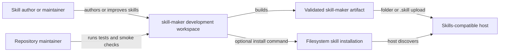
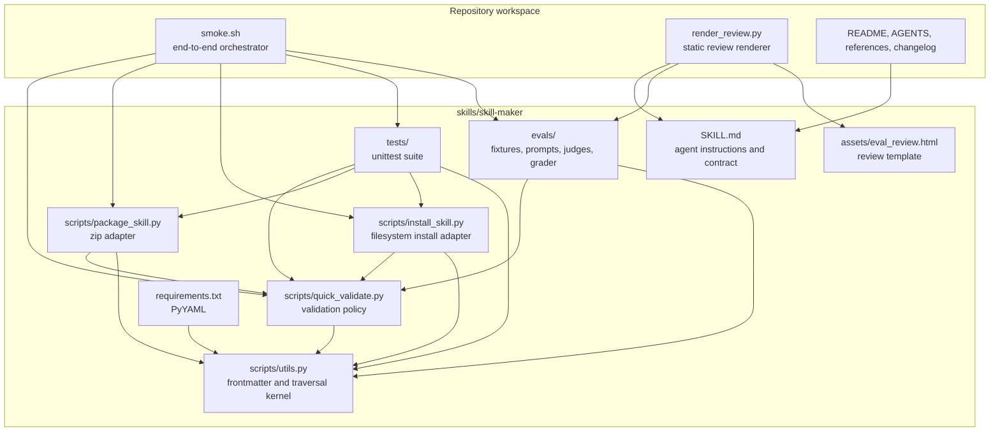
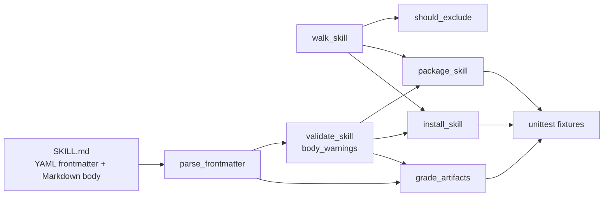
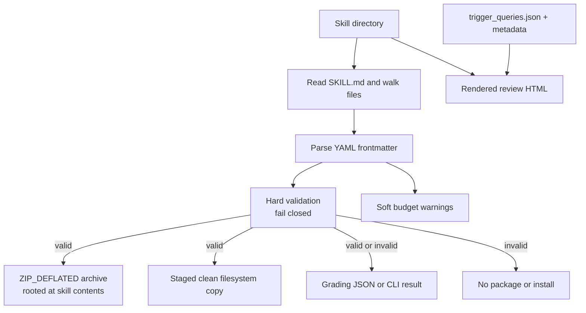

# Project Architecture Blueprint

## Document status

- **Generated:** 2026-09-30
- **Repository:** `klarrimore/skill-maker`
- **Detail level:** Implementation-ready
- **Detected project type:** Python tooling workspace with Markdown, YAML, JSON, Bash, and static HTML/JavaScript
- **Detected architecture:** Modular monolith with a layered validation core, filesystem adapters, and a separate evaluation/documentation workspace
- **Diagram style:** C4-style Mermaid flowcharts
- **Evidence rule:** This document describes observed code and repository conventions. Where a conclusion is inferred, it is labeled as such. Capabilities not found in the repository are explicitly marked absent.

## 1. Executive summary

This repository builds and tests `skill-maker`, a self-contained Agent Skill. It is not a server, library service, or long-running application. Its primary product is the folder `skills/skill-maker/`, whose `SKILL.md`, references, scripts, assets, and license form the distributable skill. The root repository is a development workspace around that artifact.

The implementation is a small modular monolith:

1. `scripts/utils.py` provides the shared artifact-parsing and file-walking kernel.
2. `scripts/quick_validate.py` enforces frontmatter, naming, file-layout, and hardening rules.
3. `scripts/eval_models.py`, `eval_adapter.py`, and `eval_store.py` define the strict evaluation contract, provider-neutral protocol, and evidence boundary.
4. `scripts/skill_eval.py` audits skills, runs paired task/trigger cases, aggregates benchmarks, and improves sandboxed candidates.
5. `scripts/package_skill.py` and `scripts/install_skill.py` adapt the validated skill into a zip archive or a clean filesystem installation.
6. `tests/` exercises the modules with temporary filesystem fixtures.
7. Root `scripts/smoke.sh` composes the individual surfaces into an end-to-end verification path.
8. `scripts/render_review.py` fills the static `assets/eval_review.html` template with real skill metadata and trigger-query data.

The dominant dependency direction is inward toward the shared parser and traversal rules. Packaging, installation, grading, and rendering are outer adapters. There is no database, remote API, service boundary, authentication subsystem, event bus, cache, container deployment, or runtime service discovery mechanism in the observed repository.

## 2. Scope and evidence

### 2.1 In scope

This blueprint covers:

- The repository workspace and its shipped `skills/skill-maker/` artifact
- Python modules under `skills/skill-maker/scripts/` and `skills/skill-maker/evals/`
- The unit tests, fixtures, evaluation data, smoke driver, and review renderer
- Artifact validation, packaging, installation, evaluation, and distribution flows
- Extension and governance guidance for future changes

### 2.2 Out of scope

The following are not runtime components of this repository:

- The external agentskills.io implementation
- Claude, Codex, or other host internals beyond the repository's documented compatibility concerns
- The generated skills that users may create with `skill-maker`
- Any user's global `~/.agents/skills/` installation after this repository writes it

### 2.3 Evidence inspected

The analysis is grounded in these repository files:

- `README.md`, `AGENTS.md`, and `CHANGELOG.md`
- `skills/skill-maker/SKILL.md`
- `skills/skill-maker/scripts/{utils,quick_validate,package_skill,install_skill,eval_models,eval_adapter,eval_store,skill_eval}.py`
- `skills/skill-maker/evals/{grade_artifacts.py,evals.json,trigger_queries.json,judge_labels.json,files/,judges/,runs/}`
- `skills/skill-maker/tests/`
- `skills/skill-maker/references/`
- `skills/skill-maker/assets/eval_review.html`
- `scripts/{smoke.sh,render_review.py,README.md}`
- `skills/skill-maker/requirements.txt`

No root `CONTEXT.md`, `CONTEXT-MAP.md`, `docs/adr/`, CI workflow, container manifest, application package manifest, database schema, or server entry point was present in the observed tree.

## 3. Architecture detection

### 3.1 Technology stack

| Concern | Observed technology | Role |
| --- | --- | --- |
| Core tooling | Python 3.8+ | Validation, packaging, installation, grading, rendering |
| Runtime dependency | PyYAML | Parse YAML frontmatter in `SKILL.md` |
| Data formats | YAML frontmatter, Markdown, JSON, JSON Lines | Skill input, docs, eval definitions, reports, fixtures |
| Orchestration | Bash | Repository smoke driver |
| Review surface | Static HTML, CSS, JavaScript | Trigger-query review page |
| Tests | Python standard-library `unittest` | Unit and integration-oriented tests |
| Distribution | ZIP_DEFLATED `.skill` archive or filesystem copy | Host upload and local installation |
| Version control | Git | Source history and release documentation |

The Python implementation intentionally uses the standard library for file operations, temporary directories, archive creation, command-line parsing, and test execution. PyYAML is the only declared package dependency.

### 3.2 Architectural pattern

The repository is best described as a **modular monolith with a layered pipeline**:

- **Domain contract:** a skill is a directory containing one root `SKILL.md` plus optional resources.
- **Shared kernel:** parsing and exclusion/traversal rules in `scripts/utils.py`.
- **Policy layer:** `quick_validate.py` checks the skill contract and emits soft budget warnings.
- **Transformation adapters:** packaging and installation consume validated skills and produce distribution forms.
- **Quality adapters:** the grader, tests, smoke driver, and review renderer exercise or present the artifact.

This resembles a lightweight hexagonal design because filesystem and CLI operations sit at the edges while the parser, validator, and traversal functions are callable directly. It is not a formal Clean Architecture implementation: there are no domain/application/infrastructure packages, dependency-injection container, repository interfaces, or framework-managed ports.

### 3.3 Guiding principles visible in the code

1. **Validate before distribution.** Packaging and installation both call `validate_skill` before writing an artifact.
2. **One exclusion policy.** `walk_skill` and `should_exclude` centralize the build/install exclusion rules.
3. **Keep the shipped skill self-contained.** Root-level `tests/` and `evals/` remain in source control but are excluded from the package.
4. **Prefer deterministic local operations.** Validation, packaging, grading, and rendering do not require network access.
5. **Make failure observable.** APIs return structured values or typed errors, CLIs use exit codes, and the smoke driver checks expected results.
6. **Preserve artifact identity.** Installation derives the destination from the source directory name and refuses source/destination overlap.
7. **Separate hard failures from advisories.** Invalid structure returns failure; body/name budget tradeoffs are reported as warnings.
8. **Keep evaluation evidence auditable.** Evals, grading reports, run summaries, fixtures, and judge prompts are stored as explicit files.

## 4. C4-style architecture diagrams

The diagrams use portable Mermaid `flowchart` syntax rather than Mermaid's optional C4 renderer. They express the same context, container, component, and data-flow relationships without depending on a specialized renderer.

### 4.1 System context



### 4.2 Container view



### 4.3 Component view of the skill artifact



### 4.4 Artifact data flow



## 5. Repository boundaries and layout

### 5.1 Workspace boundary

The repository root is development-only infrastructure around the skill artifact. Root files do not ship in `.skill` output:

- `README.md`: user-facing repository orientation and commands
- `AGENTS.md`: repository agent guidance
- `CHANGELOG.md`: release history
- `Project_Architecture_Blueprint.md`: generated architecture reference
- `scripts/`: smoke and review tooling
- `docs/`: agent conventions and primary-source research
- `.agents/` and `.github/`: instruction sources and client forwarders
- `skills/skill-maker-workspace/`: evaluation run workspace and staged outputs

### 5.2 Deliverable boundary

`skills/skill-maker/` is the portable artifact source. Its shipped content is:

- `SKILL.md`: required entry point
- `references/`: progressive-disclosure guidance
- `scripts/`: deterministic bundled commands
- `assets/`: output templates
- `requirements.txt`: PyYAML dependency declaration
- `LICENSE.txt`: Apache-2.0 license

The following directories are development-only and are removed from packaged or installed copies:

- Root `tests/`
- Root `evals/`
- `__pycache__/`, `node_modules/`, `.pytest_cache/`
- `*.pyc` and `.DS_Store`

### 5.3 Evaluation boundary

`evals/` is a source-controlled test and evidence subsystem, not part of the shipped skill. It contains:

- Versioned task and trigger contracts plus calibration labels
- Valid and intentionally broken fixtures
- A compatibility grader wrapper and historical run reports
- Seed judge prompts for subjective failure modes
- Evidence records consumed by the shipped `scripts/skill_eval.py`

## 6. Core architectural components

### 6.1 `SKILL.md`: contract and agent-facing entry point

**Purpose:** Defines what `skill-maker` does, when it should trigger, the authoring loop, validation rules, distribution paths, and bundled resources.

**Responsibilities:**

- Provides YAML frontmatter with `name`, `description`, `license`, `compatibility`, and `metadata`.
- Describes the draft, evaluate, improve, validate, and distribute loop.
- Points the agent to references when detail is needed.
- Defines portability and least-surprise expectations.
- Documents module invocation from the skill root.

**Boundary:** It is instructions and metadata, not executable application logic. The validator parses it; hosts load it.

**Extension:** Add reusable detail to `references/` and link it from `SKILL.md` instead of growing the body indefinitely. Changes to its frontmatter or body require validator and evaluation review.

### 6.2 `scripts/utils.py`: shared kernel

**Purpose:** Owns common structural operations used by validation, packaging, installation, and grading.

**Key abstractions:**

- `parse_frontmatter(content) -> tuple[dict, str]`
- `should_exclude(rel_path) -> bool`
- `walk_skill(skill_path)` yielding `(file_path, arcname, excluded)`
- Shared exclusion constants

**Interaction pattern:** Consumers call these functions directly. There is no registration mechanism or dependency injection container.

**Evolution rule:** Any change to exclusion behavior must update packager, installer, validator expectations, unit tests, and smoke assertions together. The `arcname` contract is especially important because the installer needs the skill-folder prefix while the zip adapter strips it.

### 6.3 `scripts/quick_validate.py`: policy layer

**Purpose:** Performs zero-network validation of a skill directory.

**Hard checks observed:**

- Root `SKILL.md` exists.
- Only one package-visible `SKILL.md` exists.
- Frontmatter parses as a YAML mapping.
- Only recognized top-level fields are used.
- `name` and `description` are present and strings.
- Name is normalized lowercase kebab-case and matches the directory name.
- Description is non-empty, bracket-free, and within the 1024-character limit.
- Compatibility is a string within its limit when present.
- Metadata is a mapping when present.
- The em dash character is rejected anywhere in `SKILL.md`.

**Soft checks observed:**

- Body line count over 500
- Approximate body token count over 5000
- Body byte count over the Codex advisory threshold
- Description within 5% of the hard limit
- Non-ASCII name portability warning

**Contract:** `validate_skill` returns `(bool, message)`. `body_warnings` returns a list and never changes validity. Packaging and installation depend on the first contract.

### 6.4 `scripts/package_skill.py`: archive adapter

**Purpose:** Converts a valid skill directory to `<skill-name>.skill`.

**Flow:**

1. Resolve and check the input directory.
2. Require `SKILL.md`.
3. Call `validate_skill`.
4. Create the output directory.
5. Walk files using the shared exclusion policy.
6. Strip the skill-name prefix from archive paths.
7. Write a `ZIP_DEFLATED` archive.

**Compatibility behavior:** `should_exclude` remains importable from this module as a re-export for callers that predate the shared helper. Preserve this only when maintaining existing callers; new code should import from `scripts.utils`.

### 6.5 `scripts/install_skill.py`: filesystem distribution adapter

**Purpose:** Builds a clean copy and installs it under a target skills directory, defaulting to `~/.agents/skills/`.

**Flow:**

1. Check the source directory and `SKILL.md`.
2. Validate before any write.
3. Resolve the target and derive the destination from the source name.
4. Reject source/destination overlap.
5. Return a planned result without writing for `--dry-run`.
6. Copy included files into a temporary staging directory.
7. Move an existing destination to a temporary backup when replacing.
8. Atomically replace the destination with the staged directory.
9. Restore the backup if the final swap fails.
10. Remove temporary staging and backup paths.

**Error model:** `InstallError` carries a user-facing message and a distinct exit code. Exit code `2` means an existing destination without `--force`; exit code `3` represents I/O failure.

### 6.6 `scripts/skill_eval.py`: evaluation orchestration adapter

**Purpose:** Audits a skill and its eval contract, executes a provider-neutral adapter,
grades deterministic expectations, aggregates paired benchmarks, and promotes only a
strictly better held-out candidate.

**Dependencies:** Reuses the validator, parser, strict eval models, command adapter, and
workspace evidence store. It never becomes a runtime dependency of validation, packaging,
or installation.

**Boundary:** It keeps prompts and transcripts in run artifacts, not audit metadata, and
denies command expectations unless explicitly enabled. `evals/grade_artifacts.py` is only
a compatibility wrapper for the shared deterministic artifact grader.

### 6.7 Tests and fixtures

**Purpose:** Protect contracts across pure functions, filesystem operations, CLI behavior, fixture integrity, and eval data.

**Patterns:**

- Temporary directories isolate file operations.
- Small inline skill fixtures exercise one branch at a time.
- `unittest.mock` isolates CLI environment and output behavior where needed.
- The deliberately broken fixture remains broken and is tested as a negative input.
- The valid fixture is used to test acceptance and installation.

### 6.8 Root smoke driver

**Purpose:** Provides the repository-level integration gate.

It validates the real skill, rejects the broken fixture, accepts the valid fixture, runs all unit tests, checks grader agreement, tests direct imports, packages a zip, installs a clean copy, exercises refusal and dry-run paths, renders the review UI, and optionally captures a Chrome screenshot.

The smoke driver is intentionally an orchestration script, not another application layer. It owns sequencing and expected exit codes; the Python modules own behavior.

### 6.9 `render_review.py` and `eval_review.html`

**Purpose:** Produces a reviewable static HTML page for trigger-query editing.

**Flow:**

1. Resolve the target skill directory.
2. Import `parse_frontmatter` from that skill.
3. Read `SKILL.md`, `trigger_queries.json`, and the HTML asset.
4. Replace three exact placeholders.
5. Fail if any placeholder remains.
6. Write the rendered page and parse the query JSON for a count.

This is a presentation adapter with no server and no persistent state. The HTML page contains client-side editing and export behavior; the repository script only performs deterministic template filling.

## 7. Layers and dependency rules

### 7.1 Logical layers

| Layer | Modules and files | Allowed dependency direction |
| --- | --- | --- |
| Contract and content | `SKILL.md`, `references/`, JSON eval data | Defines inputs and policy language |
| Shared kernel | `scripts/utils.py` | Depends on Python standard library and PyYAML |
| Validation policy | `scripts/quick_validate.py` | May depend on the shared kernel |
| Evaluation core | `scripts/eval_models.py`, `scripts/eval_store.py`, `scripts/skill_eval.py` | May depend on validation and shared kernel |
| Evaluation process edge | `scripts/eval_adapter.py` | Invokes only an explicit configured command |
| Distribution adapters | `scripts/package_skill.py`, `scripts/install_skill.py` | May depend on validation and shared kernel |
| Test and orchestration | `tests/`, `scripts/smoke.sh`, `scripts/render_review.py` | May invoke lower layers; lower layers must not depend on tests or smoke tooling |
| Presentation asset | `assets/eval_review.html` | Consumed by the renderer; no Python dependency |

### 7.2 Enforced dependency rules

- `scripts/utils.py` must remain free of packager, installer, evaluator, and test dependencies.
- `quick_validate.py` is the single validation policy module. Consumers should not duplicate its hard checks.
- Packager and installer must validate before writing output.
- Packaging and installation must share traversal and exclusion behavior.
- Evaluation may observe and grade implementation behavior but must not be required at runtime by the shipped validator, packager, or installer.
- Adapter writes and command checks are workspace-contained, explicit, shell-free, and auditable.
- Tests may import internal functions, but production modules must not import tests or run the test suite implicitly.
- Root orchestration may invoke modules as processes, but the modules must remain directly callable.

### 7.3 Known duplication and coupling

`quick_validate.py` maintains exclusion-related constants that mirror the shared traversal policy. This makes the validator's nested-`SKILL.md` rule explicit, but it creates a drift risk if `utils.py` changes. Any future refactor should either derive both checks from one shared predicate or add a focused consistency test.

`render_review.py` modifies `sys.path` to import the target skill's package. This is deliberate support for rendering a skill from the repository root, but it means the target directory must retain its package layout.

No circular import was observed. The dependency graph is acyclic in normal use.

## 8. Data architecture

### 8.1 Skill document model

A skill is a filesystem aggregate:

```text
skill-directory/
├── SKILL.md
├── references/        optional progressive-disclosure documents
├── scripts/           optional deterministic commands
├── assets/            optional output templates
├── requirements.txt   optional dependency declaration
└── LICENSE.txt        optional license
```

`SKILL.md` is itself a two-part document:

```text
YAML frontmatter

Markdown body
```

`parse_frontmatter` returns the frontmatter dictionary and body text without converting the body into an AST. Validation operates on the parsed mapping plus raw text for hardening checks.

### 8.2 Evaluation data model

The evaluation subsystem uses explicit JSON records:

- `evals.json`: versioned skill name, eval id/name, split, prompt, expected output, input files, failure modes, and typed expectations
- `trigger_queries.json`: versioned query records with `query`, `should_trigger`, and `split`
- `judge_labels.json`: human calibration examples with held-out labels
- `grading.json`: expectation checks with kind, text, pass state, evidence, and metrics
- `benchmark.json`/`benchmark.md`: paired runs, descriptive statistics, deltas, and diagnostics
- `history.json`: candidate parentage, validation, audit, scores, and promotion results
- `audit.jsonl`: append-only metadata without prompt, transcript, rubric, credential, or environment content

### 8.3 Artifact transformation model

`walk_skill` is the canonical projection from a source tree to build/install candidates. It emits source path, destination-relative archive path, and exclusion status. Consumers apply different destination semantics:

- **Package:** remove the source skill-folder prefix and write content at archive root.
- **Install:** keep the skill-folder prefix under the target staging parent, then atomically move it into place.
- **Validate:** inspect root `SKILL.md` and count package-visible nested `SKILL.md` files.

### 8.4 State, caching, and persistence

No application cache or database is present. Temporary state is limited to:

- Packaging output directories
- Installer staging and backup directories
- Rendered HTML output
- Evaluation run directories and JSON reports
- Optional dated state files created by skills produced using this skill, which are not state of `skill-maker` itself

The installer cleans temporary state in a `finally` block. There is no cache invalidation strategy because the repository does not cache computed application data.

### 8.5 Validation and transformation boundaries

Validation is intentionally split:

- `validate_skill`: hard structural and policy checks
- `body_warnings`: non-fatal portability and budget advisories
- `grade_artifacts`: evidence-oriented checks for a produced skill
- `unittest` and smoke: behavioral regression checks

This prevents packaging and installation from silently producing an artifact that the validator would reject.

## 9. Cross-cutting concerns

### 9.1 Authentication and authorization

No authentication or authorization subsystem exists. All operations are local filesystem operations initiated by the user or an agent with the current process permissions.

Relevant safety boundaries are instead:

- Validate before creating distribution artifacts.
- Refuse source/destination overlap during installation.
- Require `--force` to replace an existing installation.
- Provide `--dry-run` for install planning.
- Exclude development-only content from distribution.
- Preserve least-surprise behavior in the skill instructions, especially for generated skills.

If remote distribution or multi-user operation is added, authorization must be designed as a new boundary rather than inferred from the current local tooling.

### 9.2 Error handling and resilience

Observed patterns:

- Pure validation returns a boolean and explanatory message.
- Frontmatter parsing raises `ValueError` with contextual messages.
- Packaging reports precondition failures as `None` and CLI exit `1`.
- Installation raises `InstallError` with stable exit codes.
- Installer replacement uses staging, backup, and rollback on swap failure.
- Renderer exits nonzero when template placeholders remain.
- Smoke checks assert both positive and negative exit codes.

No retries, backoff, circuit breakers, remote fallbacks, or graceful degradation across services are present. The local operations fail early rather than retrying.

### 9.3 Logging and monitoring

There is no logging framework, metrics exporter, tracing, or monitoring backend. CLI progress and diagnostics use `print`, with some JSON output modes and stderr paths. The smoke driver suppresses command output and records pass/fail labels.

For future observability, preserve machine-readable stdout for successful structured results and keep diagnostics on stderr. Do not introduce prompt or sensitive content logging into audit output.

### 9.4 Validation

Validation responsibilities are distributed by boundary:

- `parse_frontmatter` validates syntax and mapping shape.
- `quick_validate` validates the skill contract and portability hardening.
- `package_skill` and `install_skill` enforce pre-write validation.
- `grade_artifacts` checks produced skills against explicit expectations.
- Unit and smoke tests validate transitions, boundaries, and failure behavior.
- Human grading handles transcript-dependent expectations.

### 9.5 Configuration management

Configuration is explicit and local:

- CLI arguments configure paths, output directories, installation target, replacement, dry-run, and JSON output.
- Module constants define budgets, recognized fields, exclusions, and exit codes.
- `requirements.txt` declares PyYAML.
- JSON and Markdown files define evaluation cases and evidence.

No environment-specific config files, secret manager, feature flags, or deployment configuration were found. Do not add secrets to `SKILL.md`, eval fixtures, or generated reports.

## 10. Service communication patterns

There are no internal services or service boundaries. All communication is direct function calls, process invocation, filesystem reads/writes, archive writes, and browser-local JavaScript.

| Requested concern | Observed status |
| --- | --- |
| HTTP or RPC protocol | Not used by repository code |
| Synchronous communication | Direct function calls and sequential CLI steps |
| Asynchronous communication | Not implemented |
| Event publication/subscription | Not implemented |
| API versioning | Not applicable; CLI behavior and artifact layout are the practical contracts |
| Service discovery | Not applicable |
| Retry or circuit-breaker policy | Not implemented |
| External resource access | Static HTML references Google Fonts in the browser; core tooling remains local and zero-network |

If a network-backed validator, registry, or hosted evaluation service is introduced, isolate it behind a new adapter and keep the current local path as the deterministic baseline.

## 11. Python-specific architectural patterns

### 11.1 Module-oriented package layout

The code uses importable packages with `__init__.py` files and is run from the skill directory as modules:

```bash
cd skills/skill-maker
python -m scripts.quick_validate .
python -m scripts.package_skill . ../../dist
python -m evals.grade_artifacts .
```

This preserves the `scripts.*` and `evals.*` import paths. Running files by path from the wrong working directory is a known failure mode and is documented in `scripts/README.md`.

### 11.2 Functional core with filesystem edges

Most validation and classification operations are ordinary functions over strings, mappings, paths, and lists. Filesystem writes are concentrated in packaging, installation, rendering, and test fixtures.

The practical seam is:

```python
frontmatter, body = parse_frontmatter(content)
valid, message = validate_skill(skill_path)
for file_path, arcname, excluded in walk_skill(skill_path):
    ...
```

This keeps core decisions directly testable without a framework.

### 11.3 Standard-library CLI adapters

`argparse` defines command interfaces. `main(argv=None)` is exposed in the installer and grader to make CLI behavior testable without spawning a process. Stable exit codes are part of the command contract.

### 11.4 Dependency management

The implementation targets Python 3.8+ and declares only `PyYAML>=5.0`. Type annotations use `from __future__ import annotations` in the shared utility module to preserve the Python 3.8 floor.

## 12. Concrete implementation patterns

### 12.1 Parse once, pass structured values

Use the parser at the document boundary and pass the mapping/body separately:

```python
frontmatter, body = parse_frontmatter(skill_md.read_text(encoding="utf-8"))
name = frontmatter.get("name", "").strip()
```

Do not reimplement frontmatter splitting in a second consumer.

### 12.2 Validate before side effects

Distribution adapters follow this shape:

```python
valid, message = validate_skill(skill_path)
if not valid:
    return None  # package adapter
# or raise InstallError(...)  # install adapter
# only then create archives, staging directories, or destinations
```

This is a key invariant. New adapters should preserve it.

### 12.3 Shared traversal and exclusion

Use the shared traversal tuple rather than independently walking the tree:

```python
for file_path, arcname, excluded in walk_skill(skill_path):
    if excluded:
        continue
    # Package or copy file_path using the adapter's destination semantics.
```

The traversal's archive-name prefix is intentional. Packaging strips it; installation keeps it.

### 12.4 Structured installer errors

Use a typed error when the caller needs a stable exit code:

```python
class InstallError(Exception):
    def __init__(self, message, code=EXIT_USAGE):
        super().__init__(message)
        self.message = message
        self.code = code
```

Errors should state the failed condition and the corrective command, such as adding `--force`.

### 12.5 Atomic replacement

For destructive filesystem changes:

1. Build in a temporary staging directory.
2. Move the existing destination to a temporary backup.
3. Replace the destination with the staged tree.
4. Restore the backup if replacement fails.
5. Remove staging and backup paths in cleanup.

Do not write directly into an existing installation tree.

### 12.6 Template rendering with placeholder checks

The review renderer uses exact placeholder replacement and rejects incomplete output:

```python
html = html.replace("__SKILL_NAME_PLACEHOLDER__", frontmatter["name"])
html = html.replace("__SKILL_DESCRIPTION_PLACEHOLDER__", frontmatter["description"])
html = html.replace("__EVAL_DATA_PLACEHOLDER__", eval_data)
if "PLACEHOLDER" in html:
    raise SystemExit(1)
```

Any new template token must be added to both the asset and renderer, plus a smoke assertion that the rendered output contains no unresolved token.

### 12.7 Contract-preserving extension

When changing a public callable:

- Preserve `validate_skill(path) -> (bool, message)` unless all consumers and tests are migrated together.
- Preserve installer exit meanings.
- Preserve the `walk_skill` yielded tuple shape or update every consumer in one change.
- Preserve archive root semantics.
- Add behavior tests for boundary and error transitions, not just source-text assertions.

## 13. Testing architecture

### 13.1 Test layers

| Test layer | Location | Purpose |
| --- | --- | --- |
| Parser and predicate unit tests | `tests/test_utils.py`, `test_quick_validate.py` | Syntax, naming, exclusion, budget, and validation branches |
| Packaging tests | `tests/test_package_skill.py` | Archive creation, path rooting, exclusions, invalid input |
| Installer tests | `tests/test_install_skill.py` | Install, replace, dry-run, refusal, default target, overlap safety |
| Evaluator unit tests | `tests/test_eval_models.py`, `test_eval_adapter.py`, `test_skill_eval.py` | Schema, containment, protocol, evidence, grading, benchmark, and candidate transitions |
| Legacy grader tests | `tests/test_grade_artifacts.py` | Compatibility wrapper over deterministic artifact grading |
| Eval data tests | `tests/test_evals_data.py` | Versioned JSON shape, fixture references, judge prompt shape, fixture behavior |
| Integration smoke | `scripts/smoke.sh` | Full CLI and artifact pipeline, expected positive/negative outcomes |
| Human review | `evals/README.md`, run reports | Transcript-dependent safety and quality judgments |

### 13.2 Test-double and fixture strategy

Tests use temporary directories and minimal inline skill documents. This isolates filesystem state and makes failures deterministic. The repository also keeps two semantic fixtures:

- `broken-skill`: must continue failing validation and must not be edited in place.
- `standup-summary`: valid input used for installation and improvement workflows.

The smoke driver verifies that the broken fixture still contains its intended violations, protecting the negative test from accidental repair.

### 13.3 Required regression coverage for changes

When changing validation:

- Add a valid case and the smallest invalid case for the changed branch.
- Test hard failure versus soft warning behavior.
- Test nested and root-only exclusion boundaries where relevant.

When changing packaging or installation:

- Test archive or destination paths, not merely non-empty output.
- Test excluded files and included nested resources.
- Test invalid input before side effects.
- Test replacement, rollback, and dry-run behavior when affected.

When changing eval data or templates:

- Validate JSON structure.
- Keep fixture references valid.
- Assert unresolved placeholders are rejected.
- Preserve audit evidence and do not overwrite read-only fixtures.

## 14. Deployment and distribution architecture

### 14.1 Distribution modes

The repository supports two artifact delivery modes:

1. **Folder-based installation:** `install_skill.py` copies a clean skill folder to a skills directory, defaulting to `~/.agents/skills/`.
2. **Zip upload:** `package_skill.py` creates a `.skill` archive rooted at the skill's own contents.

The portable distribution unit is the folder. The zip is a host-specific packaging option documented by the skill.

### 14.2 Runtime dependency resolution

The packaged skill declares PyYAML in `requirements.txt`. The bundled scripts are invoked as modules from the skill root. No web server, process supervisor, container runtime, cloud service, or orchestration platform is configured in this repository.

### 14.3 Environment adaptation

The references document manual alternatives for environments without subagents, displays, agent CLIs, or packagers. The local validator and filesystem packager remain the baseline because they require only Python, PyYAML, and a filesystem.

### 14.4 Release gate

The observed release-quality path is:

```text
edit -> unit tests -> validator -> grader -> package/install checks -> review renderer -> smoke.sh
```

There is no checked-in CI workflow in the observed repository. `bash scripts/smoke.sh` is the canonical local gate described by `AGENTS.md`.

## 15. Extension and evolution patterns

### 15.1 Add a validator rule

1. Decide whether the rule is a hard contract or a soft advisory.
2. Add the implementation in `quick_validate.py` or `body_warnings`.
3. Document the authority and rationale in `SKILL.md` or the appropriate reference.
4. Add focused valid, invalid, boundary, and message assertions.
5. Update `grade_artifacts.py` only if the property is independently gradeable.
6. Update fixtures and smoke checks if the rule changes an end-to-end path.
7. Run the full smoke driver.

Avoid duplicating rules in packaging or installation. They must consume the validator's result.

### 15.2 Add a distribution format

Create a new outer adapter that consumes the existing validated skill contract. It should:

- Validate before writes.
- Reuse `walk_skill` and exclusions.
- Define destination path semantics explicitly.
- Offer safe defaults and dry-run behavior for destructive operations.
- Return structured results and stable exit codes.
- Add unit and smoke coverage for included and excluded files.

Do not make the shared kernel know about a particular distribution host.

### 15.3 Add a new evaluation

1. Add a record to `evals/evals.json` with a unique integer id.
2. Add only the required fixture files, preferably under a copied workspace.
3. Map the expectation to a failure mode in `failure-modes.md`.
4. Use deterministic grader checks where possible.
5. Use a narrow judge prompt or human rubric for subjective behavior.
6. Record run evidence under `skills/skill-maker-workspace/` or the established run directory.
7. Keep source fixtures immutable when the eval is testing copy-first behavior.

### 15.4 Add a reference or asset

- Put long, conditional guidance in `references/`.
- Add an explicit read-this-when pointer in `SKILL.md`.
- Keep asset placeholders named and tested.
- Update the repository layout documentation when the shipped artifact changes.
- Keep development-only material under `tests/`, `evals/`, or the workspace boundary.

### 15.5 Modify an existing component safely

Preserve identity and contracts first. For installed skill workflows, keep the skill name and directory name unchanged. For Python APIs, migrate all callers in one change rather than adding permanent compatibility shims. For filesystem operations, stage and validate before replacing output.

## 16. Architectural decision records

These are reconstructed from implementation evidence, not formal ADR files. They should be treated as decisions to preserve or revisit, not as historical claims about undocumented intent.

### ADR-001: Keep the deliverable self-contained

- **Context:** Skills must be portable across compatible hosts.
- **Decision observed:** The artifact keeps entry instructions, references, scripts, assets, dependency declaration, and license under one skill directory. Root tests and evals are excluded.
- **Benefits:** A folder can be copied, installed, or packaged without the repository.
- **Costs:** Development fixtures and quality tooling live outside the shipped artifact and need separate documentation.
- **Revisit when:** A host requires a different manifest or a remote dependency model.

### ADR-002: Centralize traversal and exclusion rules

- **Context:** Packaging and installation must include the same files and exclude the same development artifacts.
- **Decision observed:** `utils.py` owns `should_exclude` and `walk_skill`; both adapters consume them.
- **Benefits:** One policy controls both distribution paths.
- **Costs:** The validator mirrors part of the exclusion logic for nested `SKILL.md` detection.
- **Revisit when:** The rule set grows enough to warrant a shared classification object or a generated manifest.

### ADR-003: Validate before side effects

- **Context:** A malformed skill should not be published or installed.
- **Decision observed:** Both package and install adapters call `validate_skill` before creating output.
- **Benefits:** Fail-closed distribution and simple operational reasoning.
- **Costs:** Validation policy changes affect all distribution paths.
- **Revisit when:** A staged artifact needs a distinct post-build validation step, which should supplement rather than replace preflight validation.

### ADR-004: Use standard-library tests and a minimal runtime dependency

- **Context:** The skill can be uploaded detached from the repository.
- **Decision observed:** Tests use `unittest`; PyYAML is the only declared package dependency.
- **Benefits:** Low setup cost and broad Python compatibility.
- **Costs:** No richer assertion or fixture framework is available by default.
- **Revisit when:** Test complexity or runtime requirements justify a documented dependency change.

### ADR-005: Run package modules from the skill root

- **Context:** Internal imports use `scripts.*` and `evals.*` package paths.
- **Decision observed:** Documentation and smoke commands use `python -m ...` from `skills/skill-maker/`.
- **Benefits:** Consistent imports for direct and CLI use.
- **Costs:** Invoking a file by path or from the repository root can fail with `ModuleNotFoundError`.
- **Revisit when:** The package is published as an installable Python distribution or all imports are made relative.

### ADR-006: Keep evaluation evidence as files

- **Context:** Skill quality includes subjective behavior, reproducibility, and auditability.
- **Decision observed:** Prompts, fixtures, grading JSON, run summaries, and judge prompts are committed or stored in the workspace.
- **Benefits:** Reviewable evidence and no database service requirement.
- **Costs:** Fixture reuse and manual aggregation can create contamination or consistency risks.
- **Revisit when:** Run volume requires indexed storage, while retaining file exports as the portable evidence format.

## 17. Architecture governance

### 17.1 Current governance mechanisms

- `AGENTS.md` defines artifact boundaries, authoritative references, and the smoke command.
- `README.md` defines layout, dependency assumptions, and supported commands.
- The skill's references define authoring, script, environment, evaluation, and schema conventions.
- The bundled validator enforces the hard artifact contract.
- Unit tests protect module and filesystem behavior.
- `smoke.sh` exercises the complete local pipeline.
- Evals and run reports track failure modes and evidence.
- `CHANGELOG.md` records user-visible architecture and tooling changes.

### 17.2 Review checklist for architectural changes

Before merging a change, ask:

- Does it change the shipped artifact boundary?
- Does it preserve the root `SKILL.md` and package-visible file rules?
- Does it duplicate a shared parser, validator, or traversal rule?
- Does it preserve validate-before-write behavior?
- Does it preserve module invocation and exit-code contracts?
- Does it require updates to references, README layout, eval schemas, or changelog?
- Does the test cover a consumer-visible boundary rather than incidental implementation text?
- Does `bash scripts/smoke.sh` still pass?

### 17.3 Security and least-privilege governance

Keep local operations explicit and bounded. Do not add unrestricted shell execution, network access, secret collection, or prompt logging to the skill or its helpers. If a future adapter needs a high-impact operation, document the permission boundary, dry-run path, refusal behavior, and audit evidence before implementation.

## 18. Blueprint for new development

### 18.1 Add or change a deterministic script

1. Confirm the work belongs in the shipped skill rather than root-only tooling.
2. Decide whether an existing command is enough; add a bundled script only for repeated deterministic work.
3. Define input flags, output shape, prerequisites, and exit codes.
4. Keep the script non-interactive and safe by default.
5. Put shared parsing or traversal in `scripts/utils.py` only when multiple consumers need it.
6. Add unit tests with temporary fixtures.
7. Add a smoke path if the behavior affects packaging, installation, validation, or rendering.
8. Document the command in `SKILL.md`, `README.md`, and `scripts/README.md` as appropriate.
9. Run the validator and full smoke driver.

### 18.2 Add a validation or contract rule

Use this sequence:

```text
classify rule -> implement hard/soft behavior -> document authority -> test boundaries
-> update grader/evals if applicable -> run smoke -> update changelog
```

A hard rule must fail with a clear reason. A soft warning must not be silently treated as either a failure or an automatic fix; the skill instructions should explain the tradeoff.

### 18.3 Add a new artifact output

Start with an adapter at the distribution edge. Reuse the validated skill model and traversal policy. Define whether output paths retain or remove the source folder prefix. Stage writes, provide dry-run behavior, and test invalid input before side effects.

### 18.4 Add a new evaluation surface

Keep the evaluator outside the shipped artifact unless the skill itself needs the capability. Define the fixture and expectation schema first, then add the smallest deterministic implementation. Record subjective expectations separately so the grader does not pretend to measure what code cannot establish.

### 18.5 Standard file organization

For a new shipped capability:

```text
skills/skill-maker/
├── SKILL.md                    # workflow and trigger contract
├── scripts/<capability>.py     # deterministic implementation
├── references/<topic>.md       # conditional detailed guidance
├── assets/<template>           # output asset, if needed
└── tests/test_<capability>.py  # development-only regression tests
```

For root-only verification or orchestration:

```text
scripts/<tool>.py or scripts/<tool>.sh
```

For eval-only behavior:

```text
skills/skill-maker/evals/
```

### 18.6 Common pitfalls

- Running `scripts/*.py` by path instead of as modules from the skill root
- Adding a top-level frontmatter field that is not in the portable field set
- Letting a nested `SKILL.md` enter the package unintentionally
- Packaging or installing before validation
- Reimplementing exclusion rules in a new adapter
- Editing the read-only broken fixture instead of copying it
- Replacing an install in place instead of staging and swapping
- Treating a soft body-budget warning as an unconditional defect
- Adding a test that only asserts a string exists rather than validating behavior
- Forgetting that evals and tests are source-controlled but not shipped
- Adding a template placeholder without a renderer replacement and smoke assertion
- Assuming the repository provides CI, a server, or an external registry when none is configured

## 19. Known gaps and future architecture options

The following are observations, not requested changes:

1. **No automated CI configuration was observed.** The local smoke driver is the documented gate. A CI wrapper could run it without changing the application architecture.
2. **Validator exclusion logic is partly mirrored.** A shared package-visible path predicate would reduce drift.
3. **The package adapter catches broad exceptions.** If operational diagnostics become important, narrow expected filesystem errors and preserve a structured error contract.
4. **The HTML review page references external fonts.** The core tooling remains local, but a fully offline review artifact would need local fonts or a system-font fallback only.
5. **Evaluation evidence is file-based and partly manual.** A future index or report generator could improve discovery while keeping JSON and Markdown as the interchange format.
6. **There is no formal ADR directory.** This blueprint records inferred decisions until a decision is explicitly resolved through the repository's domain-documentation workflow.

Do not introduce services, databases, queues, or framework layers to solve these gaps unless the product requirement actually requires them. The current architecture is intentionally small and portable.

## 20. Maintenance procedure

Update this blueprint when any of the following changes:

- The shipped artifact boundary or exclusion policy changes
- A new script, output adapter, dependency, or runtime surface is added
- The validator contract or exit-code behavior changes
- Evals gain a new storage, grading, or execution model
- A server, network integration, persistent store, CI pipeline, or deployment target is introduced
- A formal architectural decision is made or an existing decision is reversed

For a routine update, re-check the repository tree, imports, entry points, tests, smoke driver, and packaging behavior. Then update the diagrams and the relevant component section together so the prose does not drift from the implementation.
